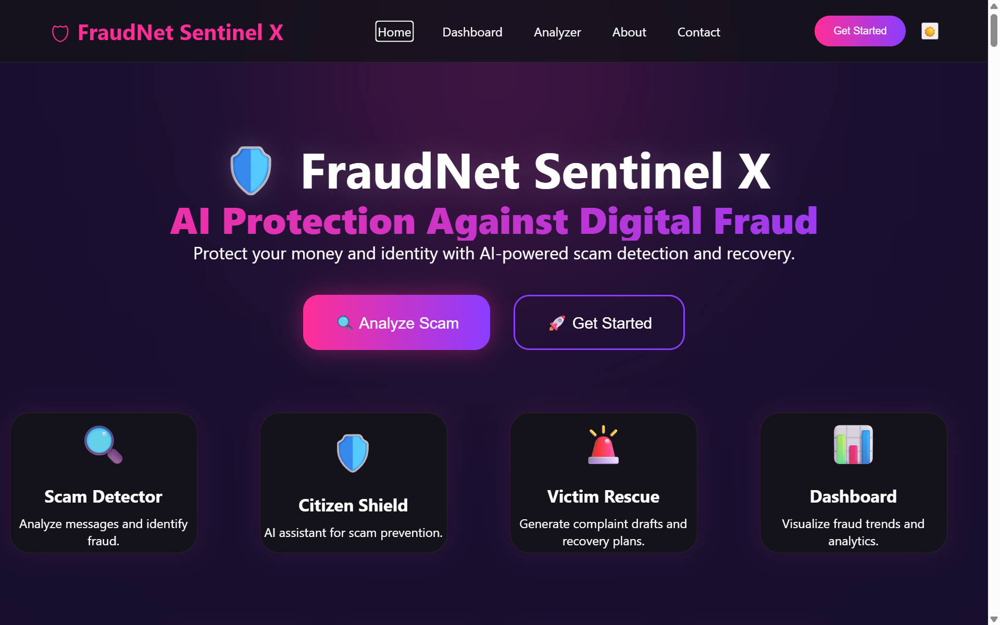
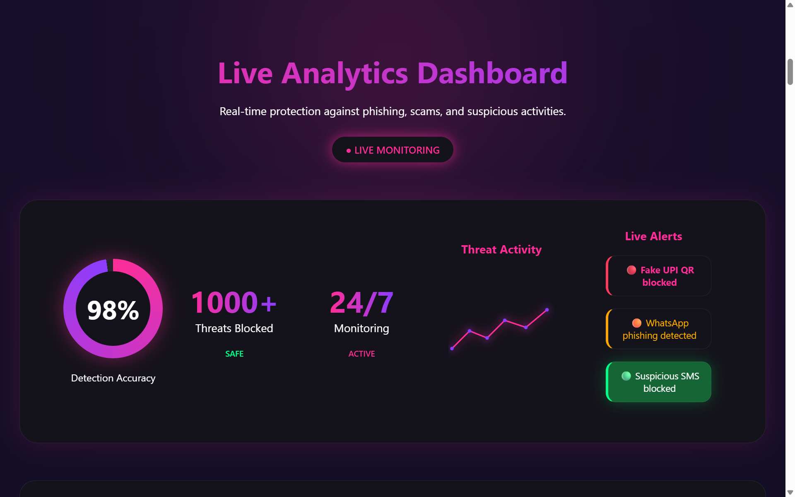
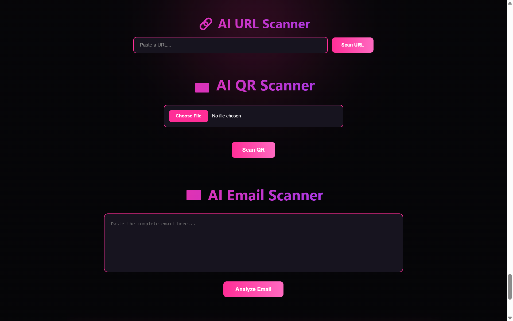
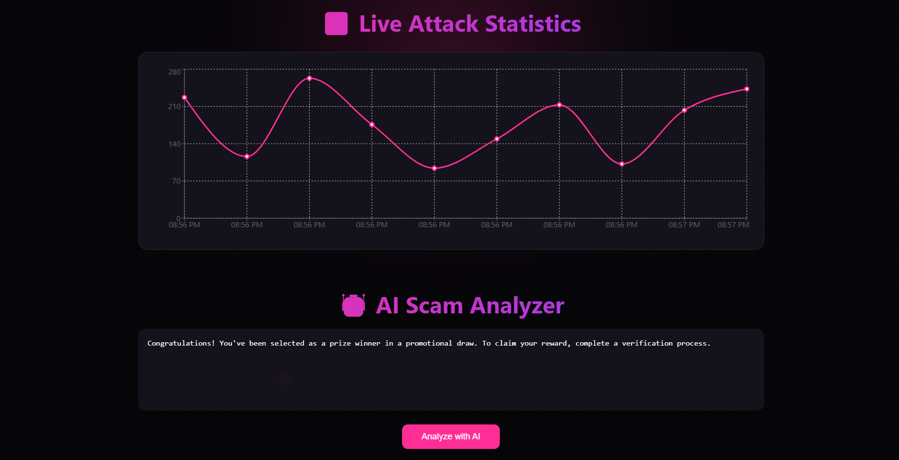
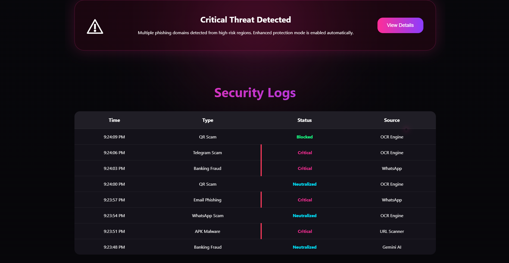
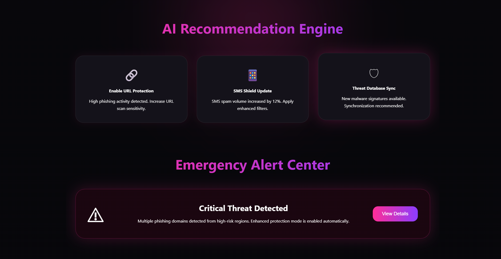

# 🛡️ FraudNet Sentinel X

<div align="center">

# AI-Powered Cyber Resilience Platform for Critical National Infrastructure

Detect • Analyze • Prevent • Respond




</div>

---

# 📌 Overview

FraudNet Sentinel X is an AI-powered cyber resilience platform developed to protect Critical National Infrastructure (CNI) from modern cyber threats including phishing, malicious URLs, financial fraud, social engineering attacks, and ransomware campaigns.

The platform combines Artificial Intelligence, real-time analytics, and intelligent threat assessment to help users detect scams, analyze suspicious content, monitor cyber incidents, and receive actionable recommendations—all from one unified dashboard.

Built with a modern React frontend and an AI-powered backend, FraudNet Sentinel X aims to improve cyber awareness while assisting organizations in responding to evolving digital threats.

---

# 🎯 Problem Statement

Critical National Infrastructure is increasingly targeted by sophisticated cyber attackers.

Traditional security systems often:

- Detect attacks too late
- Lack intelligent threat analysis
- Provide limited guidance to victims
- Fail to consolidate multiple security tools into one platform

FraudNet Sentinel X addresses these challenges through AI-assisted cyber defense and real-time threat intelligence.

---

# 🚀 Key Features

### 🧠 AI Scam Analyzer

- Detects phishing emails
- Identifies scam messages
- AI-based threat explanation
- Risk scoring

---

### 🌐 URL Security Scanner

- Detects malicious URLs
- Phishing detection
- Domain reputation checks
- URL risk assessment

---

### 📊 Interactive Security Dashboard

- Threat statistics
- Recent attack monitoring
- Security insights
- AI-generated summaries

---

### 📈 Live Attack Statistics

- Live cyber attack visualization
- Threat distribution
- Attack trends
- Real-time monitoring

---

### 📋 Security Logs

- Security event tracking
- Incident history
- Threat timeline
- Log management

---

### 🛟 Victim Rescue Center

- Immediate response guide
- Recovery recommendations
- Safety checklist
- AI-generated action plan

---

### 🤖 AI Recommendation Engine

Provides personalized security recommendations including:

- Enable URL protection
- Password updates
- Security patches
- Device hardening
- Threat database synchronization

---

# 🏗 System Architecture

```text
                    User
                      │
                      ▼
              React Frontend
                      │
          FraudNet Sentinel X API
                      │
          AI Threat Analysis Engine
          ├─────────────────────────┐
          │                         │
          ▼                         ▼
 Scam Detection              Threat Intelligence
          │                         │
          └──────────────┬──────────┘
                         ▼
                 Risk Assessment
                         │
                         ▼
             Security Dashboard
```

---

# 🛠 Tech Stack

| Category | Technologies |
|-----------|-------------|
| Frontend | React.js, Vite |
| Styling | CSS3 |
| Programming | JavaScript, Python |
| Backend | FastAPI |
| AI | Large Language Models (LLMs) |
| Security | Threat Intelligence |
| Version Control | GitHub |

---

# 📂 Project Structure

```text
fraudnet-sentinel-x/

├── frontend/
│   ├── public/
│   ├── src/
│   ├── package.json
│   └── vite.config.js
│
├── backend/
│
├── dataset/
│
├── docs/
│
└── README.md
```

---

# 📸 Screenshots

Explore the core modules of **FraudNet Sentinel X** through the following interface previews.

---

## 🏠 Home

The landing page introduces the platform and provides quick access to all cybersecurity tools and AI-powered features.


---

## 📊 Dashboard

A centralized security dashboard providing an overview of threats, analytics, system health, and key security metrics.



---

## 🔍 Scam Analyzer

Analyze suspicious emails and messages using AI-powered threat detection to identify phishing attempts and malicious content.



---

## 📈 Live Attack Statistics

Visualize cyber attack trends and monitor real-time threat activity through interactive analytics.



---

## 📋 Security Logs

Review recorded security events, alerts, and system logs for efficient incident investigation and monitoring.



---

## 🛟 Victim Rescue

Receive AI-generated recovery guidance, security recommendations, and immediate response actions after a cyber incident.



# ⚙ Installation

## Clone Repository

```bash
git clone https://github.com/palak-singh-20/fraudnet-sentinel-x.git
```

## Navigate

```bash
cd fraudnet-sentinel-x/frontend
```

## Install Dependencies

```bash
npm install
```

## Start Development Server

```bash
npm run dev
```

Open

```
http://localhost:5173
```

---

# 💡 How It Works

1. User uploads or enters suspicious content.
2. AI analyzes emails, URLs, or messages.
3. Threat intelligence engine evaluates the risk.
4. Risk score and recommendations are generated.
5. Dashboard visualizes findings.
6. Victim Rescue provides recovery guidance.

---

# 🔐 Security Capabilities

- Email Scam Detection
- URL Analysis
- Threat Intelligence
- AI Risk Scoring
- Security Recommendations
- Incident Monitoring
- Threat Visualization
- Victim Assistance

---

# 🌍 Real World Applications

- Government Organizations
- Financial Institutions
- Critical National Infrastructure
- Educational Institutions
- Healthcare Systems
- Smart Cities
- Enterprises
- Cybersecurity Operations Centers

---

# 📈 Future Scope

- Voice Scam Detection
- WhatsApp Fraud Detection
- Browser Extension
- Android Application
- SIEM Integration
- Dark Web Monitoring
- Blockchain Evidence Storage
- AI Security Copilot
- Automated Incident Response
- Zero Trust Security Integration

---

# 🏆 Hackathon

Developed for:

**AI-Driven Cyber Resilience for Critical National Infrastructure**

FraudNet Sentinel X demonstrates how Artificial Intelligence can enhance cyber resilience through proactive threat detection, intelligent analysis, and user-centric response mechanisms.

---

# 👨‍💻 Contributors

### Palak

Project Developer

GitHub:
https://github.com/palak-singh-20

---

# 🤝 Contributing

Contributions, feature requests, and suggestions are welcome.

1. Fork the repository.
2. Create a feature branch.
3. Commit your changes.
4. Open a Pull Request.

---

# 📜 License

This project is licensed under the MIT License.

---

<div align="center">

## ⭐ If you found this project helpful, please consider giving it a Star!

Made with ❤️ using AI, React & FastAPI

</div>
